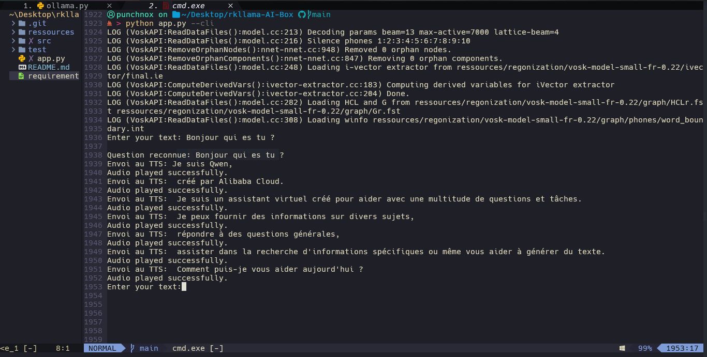

# Voice Assistant

## Objectif du projet

L'idée est de développer un assistant vocal optimisé pour des machines à faible performance. Cet assistant inclus:
1. **Reconnaissance vocale** pour comprendre les commandes.
2. **Compréhension et rédaction par IA** pour interpréter et répondre de manière intelligente.
3. **Synthèse vocale** pour fournir des réponses audibles en temps réel.

La synthèse vocale se fait en temps réel ( chaque fin de phrase/virgule... )

---

## Architecture actuelle

### Fonctionnement actuel (Windows avec WSL)
Le projet est conçu pour fonctionner sur un système Windows combiné à une VM **Ubuntu 22.04 WSL**. Voici l'architecture :
- **API (`api.py`)** : Exécutée sur WSL (Ubuntu).
- **Application principale (`app.py`)** : Exécutée sur Windows.

> **Note :** Une branche dédiée à Windows sera créée prochainement, ce qui impliquera des modifications majeures.

---

### Évolutions futures
- **Branche NPU** : Une version spécifique pour les périphériques équipés d'une unité de traitement neuronal (NPU) sera mise en place.  
  Exemple : **Orange Pi 5 Pro** avec NPU **rk3588s**.
- **Intégration RKLLAMA** : Utilisation du projet [RKLLAMA](https://github.com/notpunchnox) pour exécuter des modèles IA sur le NPU intégré.

---

## Technologies utilisées

Le projet repose sur plusieurs outils open source assez bien optimisés :
1. **[Vosk](https://github.com/alphacep/vosk)** : Reconnaissance vocale en temps réel.
2. **[Piper](https://github.com/rhasspy/piper)** : Synthèse vocale légère et efficace.
3. **[RKLLAMA](https://github.com/notpunchnox/rkllama)** : Exécution de modèles LLM sur le NPU **rk3588s**.
4. **[Ollama](https://github.com/ollama/)** : Exécution de modèles LLM sur CPU et GPU.
---

## Installation

1. Assurez-vous d'avoir Python 3 installé.
2. Installez les dépendances nécessaires avec la commande suivante :
   ```bash
   pip3 install -r requirements.txt
   ```

---

## Utilisation

### Étape 1 : Lancer le serveur (sur WSL pour l'instant)
Exécutez l'API avec :
```bash
python3 ./src/api.py
```

### Étape 2 : Lancer le client
Démarrez l'application principale avec :

* Paramètres:
    --verbose
    --cli 
    --model

```bash
python3 ./app.py
```

#### CLI mode


### Étape 3 : Phase de test
Pour tester la fonctionnalité de synthèse vocale, exécutez :
```bash
python3 ./test/client-tts.py
```

---

## Notes importantes

1. Le projet est actuellement en phase de **développement actif**, et des modifications significatives sont prévues.
2. Les fonctionnalités NPU et optimisations supplémentaires seront disponibles dans des branches futures.
